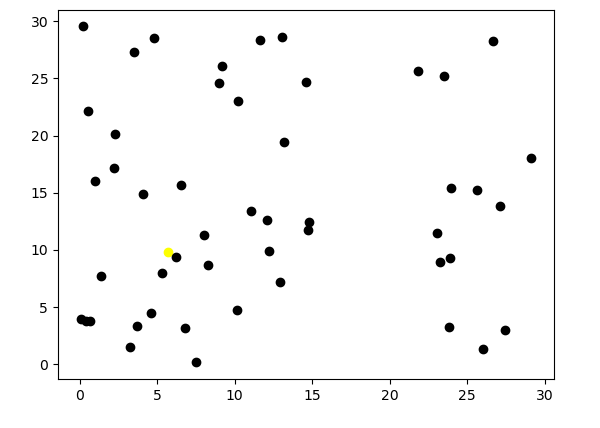
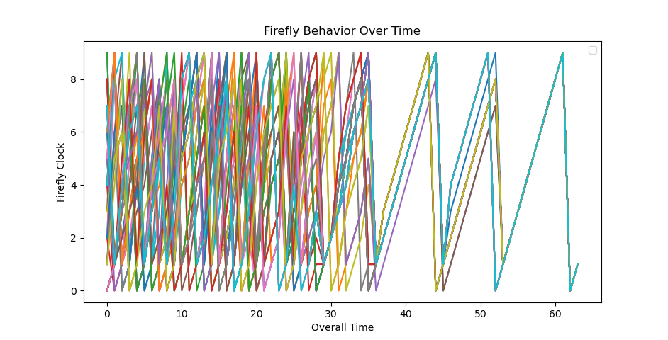
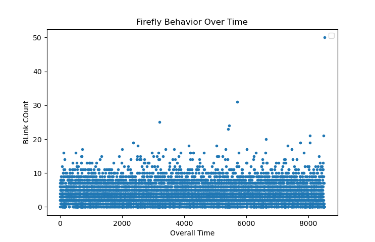
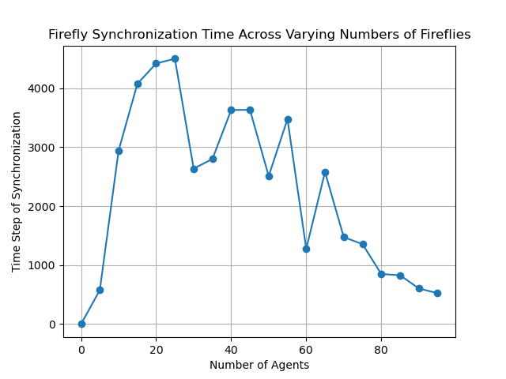
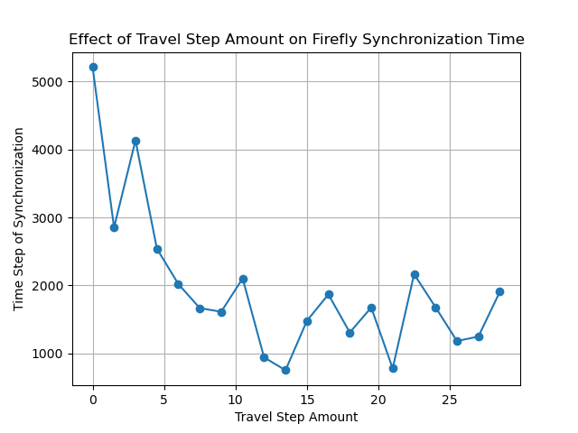
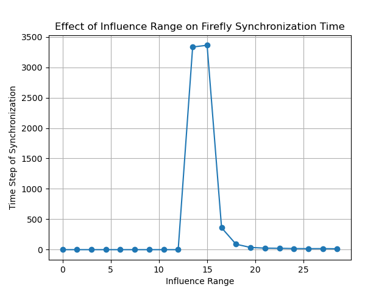

# Modeling Collective Firefly Flashing Synchronization

## Draft Report

### By Evan Lockwood and Maya Cranor

## Abstract

In this project, we plan to investigate how firefly-firefly interactions lead to
synchronized group bioillumination patterns based on parameters . To do this we
will be using an agent-based model to graphically and visually see how specific
parameters such as firefly proximity, internal clock, and persuasion changes
synchronization.

## Annotated Bibliography

For this project we are following several different papers and models.

[A model for the collective synchronization of flashing in Photinus carolinus](https://www.ncbi.nlm.nih.gov/pmc/articles/PMC9597172/)
by Madeline McCrea, Bard Ermentrout, Jonathan E. Rubin

The paper discusses the synchronized flashing behavior of male fireflies
(Photinus carolinus), both in their natural habitat and controlled environments.
It introduces a model based on an elliptic burster, capturing the repeating
pattern of multiple flashes followed by quiescent periods observed in individual
fireflies. The model demonstrates that while individual fireflies exhibit
irregular flashing patterns, interaction among multiple fireflies leads to
synchronized and more regular behavior, resembling experimental findings. By
distributing fireflies in a two-dimensional space and varying interaction
ranges, the model reveals spontaneous emergence of spatio-temporal patterns.
Additionally, the paper explores how firefly movement speed
influencessynchronization rates. This study providesinsights into the
coordination offirefly flashes and the emergence of spatio-temporal patterns in
their collective behavior.

[SYNC: The Emerging Science of Spontaneous Order](https://eclass.uoa.gr/modules/document/file.php/PHYS289/%CE%92%CE%B9%CE%B2%CE%BB%CE%AF%CE%B1/Steven%20H.%20Strogatz%20-%20SYNC_%20The%20Emerging%20Science%20of%20Spontaneous%20Order%20%282003%2C%20Hyperion%29%20-%20libgen.lc.pdf)
by Steven Strogatz

This book revolves around the interconnectedness and self-organization observed
in complex systems, where seemingly disparate elements synchronize their
behavior without central control. Strogatz goes into how synchronization emerges
from simple interactions between individual components, leading to patterns of
order at larger scales. The book explores examples ranging from the synchronized
flashing of fireflies to the coordinated firing of neurons in the brain,
offering insights into the fundamental principles underlying synchronization.

[Fireflies](https://ncase.me/fireflies/) by Nicky Case

Based on Strogatz’s description of firefly synchronization in SYNC, Nicky Case
models fireflies with internal clocks and as they nudge each other, it changes
their flash frequency until they are all synchronized.

## Experiment and Extension Description

Based on Strogatz’s book SYNC and this website we plan on making a firefly
agent-based simulation that shows how over time, the frequency of the firefly
flashes converge onto one single frequency. This will be shown both graphically
and visually.

We are currently working on an extension to do a parameter sweep through firefly
agent parameters like vision and number of fireflies to see their relationship
to how long it takes for the flashing frequency to coverage as well as if there
are any critical points in our model. We are also working on another “broken
firefly” extension when there is one firefly that does not get influenced by the
other fireflies. We will see if and how the flashes will converge and how long
that takes.

## Results

Figure 1. This is a gif of our firefly simulation. Each black dot represents a
firefly on a 30 by 30 grid. When they turn yellow, that means at that timestep
they are flashing.

Figure 2. This is a graph where each line represents a firefly. The lines plot
each firefly's internal clock overtime. Seeing a single line means that all the
firefly clocks are syncronized.

Figure 3. This graph plots the total number of flashes/blinks that occurs at
each timestep. Since there were 50 fireflies in the model with the creation of
this graph, once the blink count hits 50, that means the fireflies are
syncronized.

## Interpretation

Figure 1 is a good visual representation to see our firefly movement and
flashes. If the gif could run long enough, you can visually see how clusters
form and eventually synchronization occurs.

Figure 2 allows us to see the behavior of each firefly. Initially all the
firefly clocks are unsynced but around the overall time of 35, four clusters
begin to for and by time 52, a single line is shown, meaning the fireflies have
synchronized.

Figure 3 gives us an understanding of the number of flashes occurring at every
timestep. There appears to be no distinct pattern before the fireflies
synchronize around timestep 8250. More time needs to be spent with this graph.

## Extension
While constructing our model, we noted that adjustments to the parameters resulted in notable variations in synchronization speed or its occurrence. We wanted to explore the limits of our model and analyze the influences of parameters such as the number of fireflies, travel step of the fireflies, and fireflies influence range.

### Number of Fireflies

 Grid size: 30, Travel step: 6, Influence range: 15, Clock cycle: 10 
 

Thoughts will go here...

### Travel Step of Fireflies

 Grid size: 30, Number of agents: 60, Influence range: 15, Clock cycle: 10 
 

Thoughts will go here...

### Fireflies Influence Range

 Grid size: 30, Number of agents: 60, Travel step: 6, Clock cycle: 10 
 

Thoughts will go here...

## Causes for Concern

Moving forward, we need to begin our implementation of our extension meaning we
need to:

1. Conduct a parameter sweep for our firefly agents
2. Create a new firefly agent that can be placed in our model.

## Next Steps

For next steps we will focus on getting our extension up and running. This means
we need to create a new firefly agent that is selected to not be influenced by
the other fireflies. Within the next week we can make sure we make graphs that
involve our parameter sweep.
