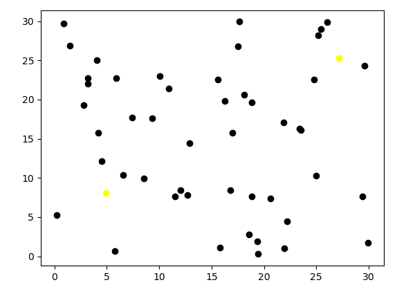
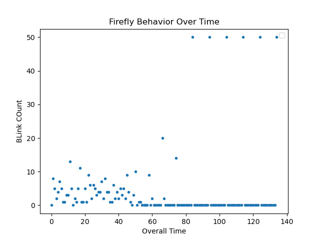
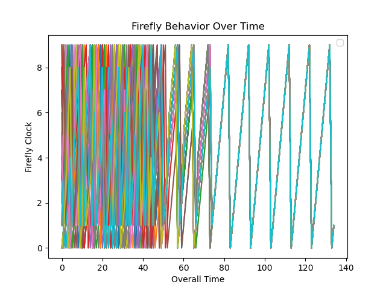
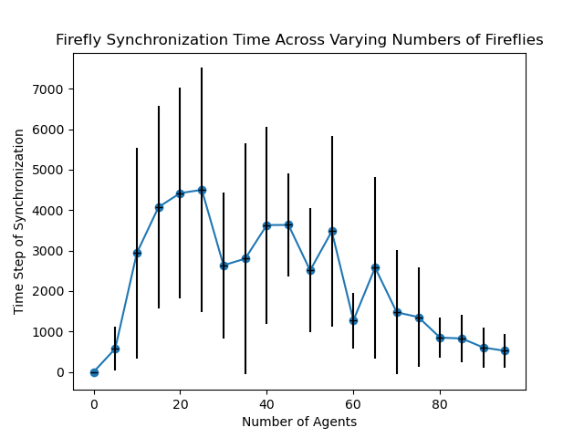
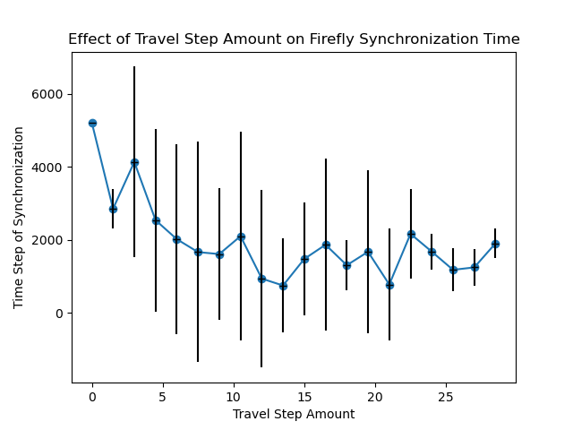
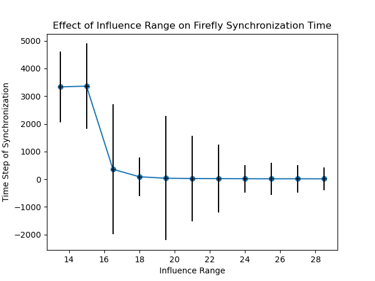
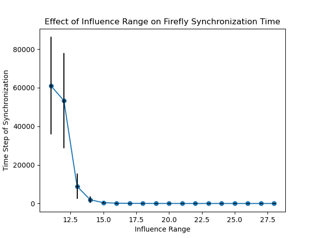

# Modeling Collective Firefly Flashing Synchronization

### By Evan Lockwood and Maya Cranor

## Abstract

In this project, we investigate how firefly-firefly interactions of specific
firefly species lead to synchronized group bioillumination patterns based on
certain firefly parameters. We implemented an agent-based model to replicate the
synchronizing behavior of these fireflies and then graphically and visually saw
how parameters such as firefly influence range, traversal step, and number of
fireflies changes the time to synchronization. We found, generally, that
increasing the number of agents, traversal step size, and influence range will
decrease the time to synchronization. However, we also found a high amount of
variability in the data, which we will discuss how this affects the overall
characteristics of our findings.

## Introduction

Synchronization is a natural phenomenon that occurs in many populations of
biological oscillators such as pacemaker cells, neurons in the brain, and some
species of fireflies. The synchronization is thought to be a mating signal, so
female fireflies are able to find male fireflies of their own species. This
biological occurrence creates a stunning visual where the entire sky fills up
with light at once.

In the early 1900s, scientific papers were written to try to understand how
fireflies were seemingly able to synchronize their flashes. Some determined that
it was mere coincidence, others speculated the atmospheric conditions in
Southeast Asia were the cause, and a few believed a conductor firefly led the
rest of the fireflies. It wasn’t until the 1960s when biologist John Buck
observed that these fireflies appeared to flash at a regular intervals, just
offset from each other, leading Buck to believe that each firefly had their own
internal clock that determines when an individual firefly flashes. In the lab,
he then discovered that fireflies will synchronize with an artificial flashing
light. The firefly will adjust their own flash in a predictable pattern, like an
internal metronome that calibrates to the flashes of other fireflies. Different
species of firefly have different mechanisms of synchronization depending on
whether the firefly was about to flash or halfway between flashes. Some species
simply move their clock forward everytime they receive a stimulus (flash). This
is the type of firefly we will be investigating for the rest of this report.

We explored this phenomenon by creating an agent-based model based off of this
description of firefly synchronization. An agent-based model simulates the
interactions between individual agents to understand the behavior of the overall
model. Individual agents have rules that govern their interactions with each
other and a seemingly innocuous rule can lead to unexpected universal behavior.
For our agent-based model, agents (fireflies) will follow one simple rule:
everytime a non-flashing firefly sees a flashing firefly, their internal clock
is nudged forward.

## Methodology

Each firefly agent in our model has several different parameters that govern
their ability to synchronize. Each agent has a traversal step size, an influence
range, and a clock cycle. The traversal step size determines the maximum
distance the firefly agent is able to move within the model at each time step.
The step size is multiplied by a random float between -1 and 1 and this value is
added to the firefly’s current location. If the step size allows a firefly to
travel outside of the grid, the firefly is replaced inside the grid at a random
location. The influence range determines if a flashing firefly is close enough
to influence a non-flashing firefly’s internal clock. The influence range is a
radius around each firefly. The clock cycle controls the time it takes each
firefly to flash. For the rest of the report, the clock cycle will be set to 10,
which means that each firefly flashes every 10 time steps. Each time step, the
clock will increase by 1, since time is increasing. If there are flashing
fireflies within a non-flashing firefly’s influence range, the non-flashing
firefly’s internal clock will also increase by the number of flashing fireflies
within range.

The environment is modeled by a 30x30 grid where fireflies are graphed as a
scatter plot. The model allows us to adjust the number of fireflies in the
model.

At each time step the following happens, in this order:

1. Non-flashing fireflies check to see if there are any flashing fireflies
   within their influence range. If there are, the non-flashing firefly’s clock
   is nudged. If there are none, then the non-flashing firefly is not nudged.
2. If a firefly has reached 10 on its internal clock, they will flash and their
   internal clock resets to 0.
3. The firefly will then move by a factor of the traversal step.
4. The clocks of all fireflies increase by 1.
5. Again, check to see if a firefly has reached 10 on its internal clock, and if
   they have, they will flash and their internal clock will be reset to 0.

## Replication Results

    <figure>
        
        
Figure 1. A visualization of our agent-based model. A black point represents a
    non-flashing firefly while a yellow point represents a flashing firefly. This
    particular model synchronized in ~30 seconds. The parameters are: Grid size: 30,
    Number of agents: 50, Travel step: 6, In range: 15, Clock cycle: 10.

    </figure>

    <figure>
        
        
Figure 2*. Replication results plotting the total number of flashes (blinks)
    at each timestep until synchronization. This model uses 50 agents so once the
    number of flashes reaches 50, the model is synchronized.

    </figure>

    <figure>
        
        
Figure 3*. Replication results plotting the internal clock cycle of each
    firefly in the model. Synchrony is reached once each firefly’s internal clock
    aligns, as seen in the graph.

    </figure>

\*Both graphs used the following parameters: Grid size: 30, Number of agents:
50, Travel step: 5, Influence range: 20, Clock cycle: 10. These parameters were
chosen to best visually represent the synchronization of our model.

These Figures serve as an illustration demonstrating the synchronization
capability of our firefly model over time. Figure 2 displays the blink count at
each time step. Once all fireflies are synchronized, the blink count should
reach 50, followed by nine consecutive time steps with zero blinks. This
synchronization typically occurs around time step 80, as depicted in our graph.
Notably, there seems to be a critical point around time step 70, where the
fireflies transition rapidly from nonsynchronous to synchronized states. This
transition from partial to full synchronization happens extremely fast. Figure 3
illustrates the clock readings of all 50 fireflies over time. Similar to the
blink count graph, this representation also showcases the synchronization of all
fireflies over time. Note that for visualization purposes, we deliberately
selected parameters that facilitate rapid synchronization of fireflies,
resulting in less crowded graphs.

## Extension Methodology

For an extension we explored the variance we saw in the model by sweeping the
main parameters. To do this we picked default parameters and then swept the
number of agents, travel step, and influence range individually. When sweeping
we took 20 evenly spaced data points amongst a range that made sense for a grid
size of 30. Each data point was captured 10 times and we presented the average.
This was done because of the high amount of variability that we found in the
model. If the simulation reached over 10,000 time steps we stopped it since it
was otherwise taking too long to run. This skews the results slightly, and is
discussed below on parameters where this has a bigger impact on.

## Extension Results

    <figure>
        
        
Figure 4. A parameter sweep of the number of agents in the model. The graph
    plots the number of time steps it takes to synchronize at a given number of
    agents. The error bars have been added to show the standard deviation at each
    data point. The set parameters for this model are: Grid size: 30, Travel step:
    6, Influence range: 15, Clock cycle: 10.

    </figure>

Figure 4 depicts the average time it takes for various numbers of fireflies to
synchronize on a 30x30 grid. Initially, increasing the number of fireflies
increases the time required for synchronization. However, the grid reaches a
critical point or ‘saturation’, where every additional firefly decreases the
time needed to achieve synchronization. It makes sense that with a small number
of fireflies, synchronization would occur quickly, as there are fewer fireflies
cycling at different rates. From 0 to 25 fireflies, each additional firefly
burdens the synchronization process. Then, when the mass of fireflies reaches a
critical point, each additional firefly enhances the influence of the mass of
flashing fireflies on the non-synchronous fireflies, while also expanding the
collective range of influence. This explains why adding more fireflies after
reaching the critical amount reduces the number of time steps needed for
synchronization. Except for the data points at the beginning and end, there is a
high standard deviation for the data. Which explains why the graph doesn’t have
a smooth line. The high standard deviation makes the overall trend much weaker.
While an extremely high number of fireflies will mean a short time till
synchronization, a medium number of fireflies is not guaranteed to be any faster
than a smaller amount of fireflies.

    <figure>
        
        
Figure 5**. A parameter sweep of the agent travel step. Plotted is the
    number of time steps needed for synchronization at increasing travel step
    values. The error bars have been added to show the standard deviation at each
    data point. The set parameters for this model are: Grid size: 30, Number of
    agents: 60, Influence range: 15 Clock cycle: 10, Max time steps: 10,000.

    </figure>

Figure 5 depicts the average time it takes for fireflies with different travel
steps to synchronize on a 30x30 grid. A travel step represents the possible
range within which a firefly can move on the grid. For each time step, a random
number within the travel step range is selected to adjust the firefly's
coordinates. The data indicates a critical point around a travel step of 6.
Prior to reaching 6, increasing the travel step reduces the synchronization
time. However, after reaching 6, the results fluctuate between 500 and 2000. The
consistency of results after 6 makes sense, as the movement becomes large enough
compared to the grid size to resemble teleportation. If we implemented the
firefly movement to be more continuous and less choppy, we’d expect the results
to be similar, however we predict that there would be a less defined critical
point, as the fireflies wouldn’t be able to “teleport”. Except for the data
points at the beginning and end, there is a high standard deviation for the
data. Which explains why the graph doesn’t have a smooth line. The high standard
deviation makes the overall trend much weaker.

    <figure>
        
        
Figure 6**. A parameter sweep of agent influence range showing the number of time steps needed to synchronize against the given influence range. The error
    bars have been added to show the standard deviation at each data point. The set
    parameters for this model are: Grid size: 30, Number of agents: 60, Travel step:
    6, Clock cycle: 10, Max time steps: 10,000.

    </figure>

    <figure>
        
        
Figure 7. A parameter sweep of agent influence range showing the number of
    time steps needed to synchronize against the given influence range. The error
    bars have been added to show the standard deviation at each data point. The set
    parameters for this model are: Grid size: 30, Number of agents: 60, Travel step:
    6, Clock cycle: 10, Max time steps: 100,000.

    </figure>

Figure 6 depicts the synchronization time of fireflies with varying influence
ranges on a 30x30 grid. Our code executed until either the fireflies
synchronized or 10,000 time steps were completed. Across influence ranges from 0
to 13, the fireflies failed to synchronize within the allotted 10,000 time
steps. Theoretically, synchronization should occur, but the required time
extends exponentially. To investigate further, we conducted another simulation
allowing the code to run up to 100,000 time steps instead of 10,000, as
described in Figure 7. This time, we were able to observe synchronization up to
an influence range of 11 before reaching the maximum time step. Figure 6
demonstrates a similar exponential trend observed in Figure 6. Both figures
exhibit a critical point around an influence range of 15, where the time for
synchronization levels off. This stabilization around 15 aligns with the 30x30
grid size, allowing any firefly in the middle to influence all others. All
influence ranges above 15 are approximately the same, as most fireflies will be
able to see all other fireflies. Notably, there is a high standard deviation for
the data before the critical point. Which shows the big impact that randomness
has on the model.

\*\* Note that it is not possible for there to be a negative number of time
steps; this is simply the lower bound of the standard deviation and could not
happen in the context of our model.

## Conclusion

While we do not entirely understand why nature is often driven into synchrony,
agent-based models help us understand how basic agent-agent interactions, such
as the simple rule of nudging a firefly’s clock, can lead to unexpected emergent
properties like synchrony.

An important assumption we have in this model is that the firefly agents have
complete 360° vision. In nature, fireflies have blindspots which would limit
their vision. With limited vision, the number of flashing fireflies able to
influence a non-flashing firefly would decrease, which could possibly lead to a
longer time to synchronization.

It is again important to note the high standard deviation in our results. We
first saw this notable deviation while first testing our model replication and
it is confirmed in our extension. We are unable to say this data is
statistically significant, but in general terms, increasing the number of
agents, traversal step, and influence range will decrease the time to
synchronization. This is because with more agents, movement, and the ability to
see more fireflies each individually increase the number of agents that are able
to influence a firefly. If a non-flashing firefly can see more flashing
fireflies, its clock will be nudged more. Increasing the amount a clock is
nudged gets the non-flashing firefly more close to synchrony.

While we do not model a specific firefly species, we instead simplified our
design to model a general oscillator within the context of fireflies. This way,
our model can be applicable to other oscillators, natural or artificial, and can
be used as a framework to produce the ideal conditions for synchronization.

## Annotated Bibliography

For this project we are following several different papers and models.

[A model for the collective synchronization of flashing in Photinus carolinus](https://www.ncbi.nlm.nih.gov/pmc/articles/PMC9597172/)
by Madeline McCrea, Bard Ermentrout, Jonathan E. Rubin

The paper discusses the synchronized flashing behavior of male fireflies
(Photinus carolinus), both in their natural habitat and controlled environments.
It introduces a model based on an elliptic burster, capturing the repeating
pattern of multiple flashes followed by quiescent periods observed in individual
fireflies. The model demonstrates that while individual fireflies exhibit
irregular flashing patterns, interaction among multiple fireflies leads to
synchronized and more regular behavior, resembling experimental findings. By
distributing fireflies in a two-dimensional space and varying interaction
ranges, the model reveals spontaneous emergence of spatio-temporal patterns.
Additionally, the paper explores how firefly movement speed
influencessynchronization rates. This study providesinsights into the
coordination offirefly flashes and the emergence of spatio-temporal patterns in
their collective behavior.

[SYNC: The Emerging Science of Spontaneous Order](https://eclass.uoa.gr/modules/document/file.php/PHYS289/%CE%92%CE%B9%CE%B2%CE%BB%CE%AF%CE%B1/Steven%20H.%20Strogatz%20-%20SYNC_%20The%20Emerging%20Science%20of%20Spontaneous%20Order%20%282003%2C%20Hyperion%29%20-%20libgen.lc.pdf)
by Steven Strogatz

This book revolves around the interconnectedness and self-organization observed
in complex systems, where seemingly disparate elements synchronize their
behavior without central control. Strogatz goes into how synchronization emerges
from simple interactions between individual components, leading to patterns of
order at larger scales. The book explores examples ranging from the synchronized
flashing of fireflies to the coordinated firing of neurons in the brain,
offering insights into the fundamental principles underlying synchronization.

[Fireflies](https://ncase.me/fireflies/) by Nicky Case

Based on Strogatz’s description of firefly synchronization in SYNC, Nicky Case
models fireflies with internal clocks and as they nudge each other, it changes
their flash frequency until they are all synchronized.
