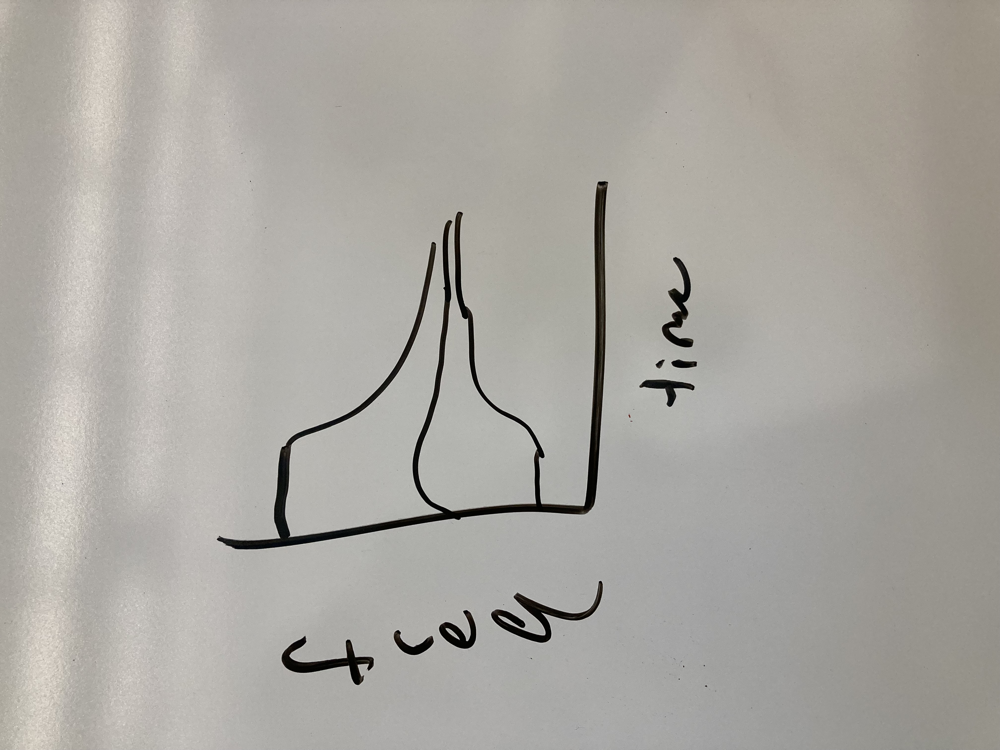
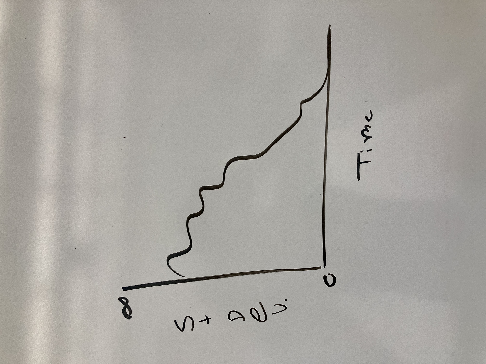
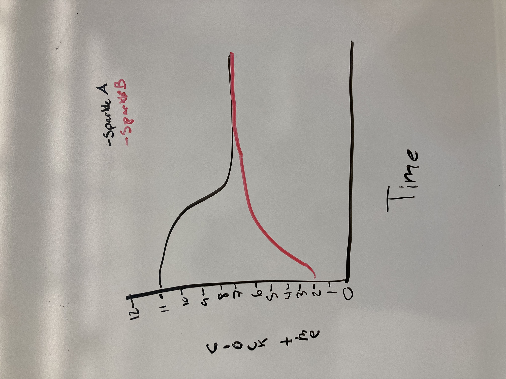
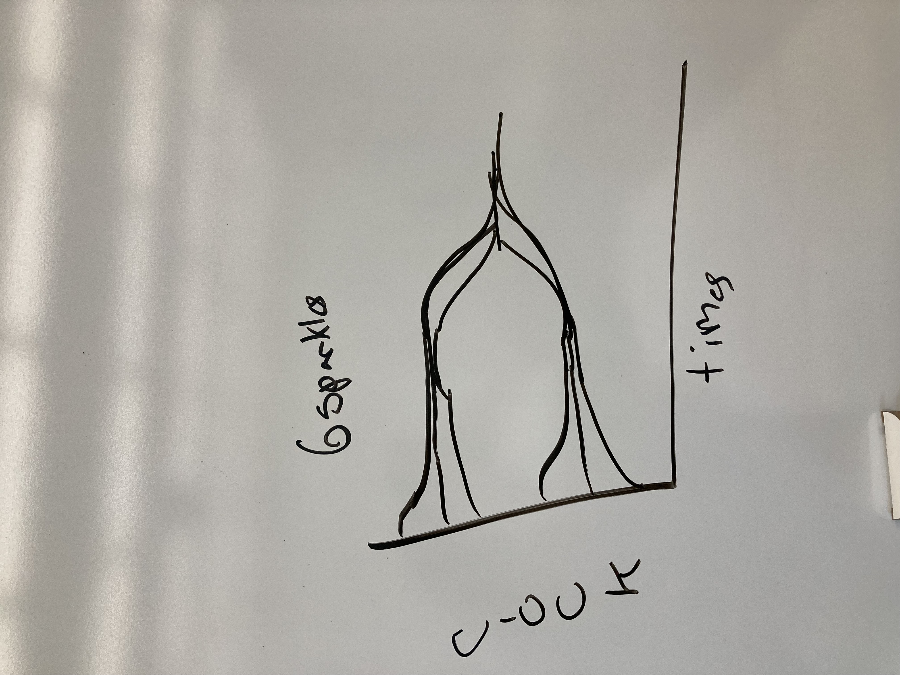

# Modeling Collective Firefly Flashing Synchronization

## Project Proposal

### By Evan Lockwood and Maya Cranor

In this project, we plan to investigate how firefly-firefly interactions lead to
synchronized group bioillumination patterns based on parameters . To do this we
will be using an agent-based model to graphically and visually see how specific
parameters such as firefly proximity, internal clock, and persuasion changes
synchronization.

For this project we are following several different papers and models.

[A model for the collective synchronization of flashing in Photinus carolinus](https://www.ncbi.nlm.nih.gov/pmc/articles/PMC9597172/)
by Madeline McCrea, Bard Ermentrout, Jonathan E. Rubin

The paper discusses the synchronized flashing behavior of male fireflies
(Photinus carolinus), both in their natural habitat and controlled environments.
It introduces a model based on an elliptic burster, capturing the repeating
pattern of multiple flashes followed by quiescent periods observed in individual
fireflies. The model demonstrates that while individual fireflies exhibit
irregular flashing patterns, interaction among multiple fireflies leads to
synchronized and more regular behavior, resembling experimental findings. By
distributing fireflies in a two-dimensional space and varying interaction
ranges, the model reveals spontaneous emergence of spatio-temporal patterns.
Additionally, the paper explores how firefly movement speed influences
synchronization rates. This study provides insights into the coordination of
firefly flashes and the emergence of spatio-temporal patterns in their
collective behavior.

[SYNC: The Emerging Science of Spontaneous Order](https://eclass.uoa.gr/modules/document/file.php/PHYS289/%CE%92%CE%B9%CE%B2%CE%BB%CE%AF%CE%B1/Steven%20H.%20Strogatz%20-%20SYNC_%20The%20Emerging%20Science%20of%20Spontaneous%20Order%20%282003%2C%20Hyperion%29%20-%20libgen.lc.pdf)
by Steven Strogatz

This book revolves around the interconnectedness and self-organization observed
in complex systems, where seemingly disparate elements synchronize their
behavior without central control. Strogatz goes into how synchronization emerges
from simple interactions between individual components, leading to patterns of
order at larger scales. The book explores examples ranging from the synchronized
flashing of fireflies to the coordinated firing of neurons in the brain,
offering insights into the fundamental principles underlying synchronization.

[Fireflies](https://ncase.me/fireflies/) by Nicky Case

Based on Strogatz’s description of firefly synchronization in SYNC, Nicky Case
models fireflies with internal clocks and as they nudge each other, it changes
their flash frequency until they are all synchronized.

Based on Strogatz's SYNC and Case's Fireflies we plan on making a firefly
agent-based simulation that shows how over time, the frequency of the firefly
flashes converge onto one single frequency. We will also calculate and plot the
deviation of the firefly flashes from the average flash time.

Possible extension: Will two large groups of fireflies synchronize?

Here is what believe our results will look like:

Our extension results could possibly look like this:

The results will be considered consistent with the original material if all
firefly flash frequencies converge and synchronize into one flash frequency. We
can determine our consistency by using the same parameters as the ones found on
this website and see if we get similar time to synchronization.

We have some areas of concern for the project, including:

1. Determining how to differentiate the implementation of frequency and start
   times for individual firefly flashing
2. Implementing randomized movement (should this be a 2D or 3D model)

Here are our next steps for the upcoming week:

Week 1:

1. Read the McCrea paper and the firefly synchronization section from SYNC
   Determine if using the Boids structure is applicable to our project. If so,
   we can use it as the baseline for our agent-based model
2. If not, we have to figure out how we want to model our agents
